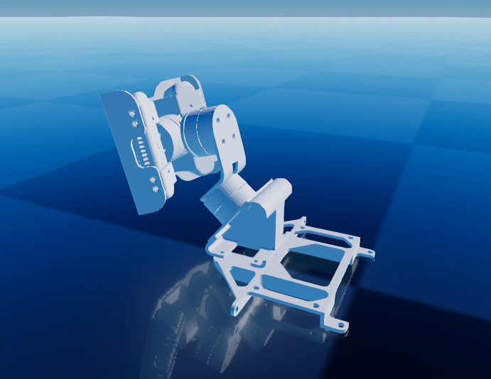

# Overview
This is a standalone ros2 node that is designed to run alongside Raisin.

## gimbal_com node
The gimbal_com node is responsible for the actual serial communication.
It is subscribed to the "railab_raibo/gimbal_command" topic from which it receives roll/pitch/yaw commands (in the base frame) and publishes the information necessary for coordinate transformation to the "/gimbal_state" topic.
The port name should be passed to its constructor.

```cpp
std::string portname = "/dev/ttyACM0";
auto gimbal_com = std::make_shared<gimbal_com>(portname);
```

The "gimbal" member of the gimbal_com node sets up the serial port and provides the methods to get the transformation from the camera frame to the gimbal base frame.

The transformation for the left camera is published to the "railab_raibo/L_cam".
The transformation for the right camera is published to the "railab_raibo/R_cam".
Message type is: https://docs.ros2.org/foxy/api/geometry_msgs/msg/Transform.html

The origin of the base is the midpoint of the line connecting the two mounting holes.

