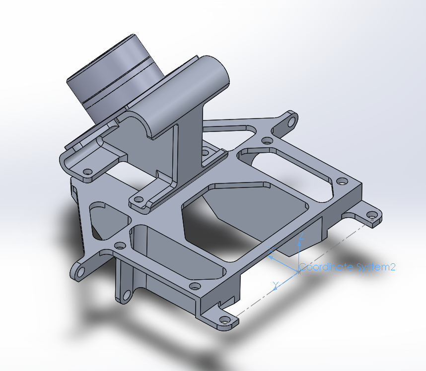

## Usage

# commander node

The commander node receives commands from raisin and publishes them to the "/gimbal_command" topic. There are two ways it generates commands.
The first way is using a zero target (passive). The second way is by using the robot state (active).

# gimbal_com node
The gimbal_com node is responsible for the actual serial communication.
It is subscribed to the "/gimbal_command" topic from which it receives roll/pitch/yaw commands (in the base frame) and publishes joint states to the "/gimbal_state" topic.
The port name (std::string) should be passed to its constructor.

```cpp
auto gimbal_com = std::make_shared<gimbal_com>(portname);
```

The "gimbal" member of the gimbal_com node sets up the serial port and provides the methods to get the transformation matrix from the camera frame to the gimbal base frame.

```cpp
// first, the joint state is set
gimbal.setState(0.1,0.2,0.3);

// then we use these methods to get the transfomation matrix
gimbal.getHmatrix_L(); //for left camera
gimbal.getHmatrix_R(); //for right camera
```

The transformation matrix is published to the "railab_raibo/gimbal_state" topic as an array of 12 doubles.
The first 9 elements are the rows of the rotation matrix. The remaining three elements represent the position vector of the cameras with respect to the origin of the base.

The origin of the base is the midpoint of the line connecting the two mounting holes.

